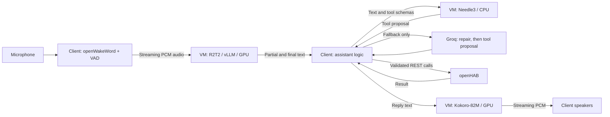

# PoC Home Automation Voice Assistant

A proof of concept for fast, conversational voice control of an openHAB home, with streaming transcription, spoken replies, timers, temperature queries, and weather.

## Why this architecture?

The aim is **near real-time answers without a large language model in every interaction**. The microphone client detects wake words locally, then streams audio to a shared inference machine. R2T2 produces incremental transcription, the small Needle3 model selects tools, and Kokoro streams speech back as it is generated. Capture, transcription, and audio delivery overlap to reduce waiting. Keeping the heavy models loaded on a separate machine lets a modest client use a shared GPU.

Most assistant logic stays on the client: item discovery, room aliases, command validation, timers, weather, openHAB requests, and playback. Straightforward commands take the short Needle3 path. When Needle cannot produce a valid call, **fast Groq inference** with `openai/gpt-oss-120b` repairs the transcript and retries Needle; only if that still fails does Groq propose a tool call itself. Every proposal passes the same client-side validation before execution. This keeps the cloud fallback out of the normal path while helping with transcription mistakes and harder phrasing.

This is an enthusiast PoC, not a finished appliance. Response time depends on microphone quality, network latency, GPU, and concurrent load.

## Architecture



The inference server never executes home commands. Its authenticated API can also serve other projects; see [API.md](API.md) and [the standalone Python client](clients/inference_client.py). ASR sessions have separate state. Up to 16 connections share loaded models through fair queues; GPU work is interleaved between chunks, not duplicated per connection.

## Features

- Local CPU wake detection for **Hey Jarvis** and **Alexa**, microphone gain, pre-roll, and transcription confirmation for weak wake candidates.
- Incremental R2T2 transcription and continuation across short pauses.
- Needle3 tool selection with confidence, item, argument, range, and explicit ON/OFF checks. Stale session results cannot act; failed device commands are not automatically replayed.
- Configurable room aliases, default rooms and devices, and exclusion lists used by both Needle and Groq.
- Kokoro-82M streamed replies, `af_heart` voice, **1.2x speaking speed** by default.
- Local time and date: “what time is it” / “what time it is” and “what day is it” / “what is the date”. Answers use the microphone client's system timezone, for example “It is 3:09 PM” or “Sunday September 20”, with `[time:]` / `[date:]` in the live log. These queries bypass Needle and Groq.
- One persistent timer (one second to 24 hours), openHAB remaining-time display, and a soft repeating chime. Say “cancel timer”, or “stop” in the quiet gaps while ringing.
- Inside/outside temperature readings from configured openHAB items; current, today, and tomorrow weather from Open-Meteo for your configured location.
- A clean live transcript with one line per wake, compact command JSON in brackets, `[groq repair:]`, `[groq call:]`, and result messages. Separate diagnostics and call timings.

## Requirements

The primary setup uses a **Windows client with Python 3.12**, a microphone and speakers, an existing openHAB instance, and an **Ubuntu inference server with Python 3.12 and a working NVIDIA CUDA driver**. A C920 microphone has been used, but the input device is configurable.

The server has been run on an 8 GB V100-class GPU with 16 GB system RAM. The tested stack uses vLLM 0.14.0, PyTorch 2.9.1, FP16, eager execution, and `asr_gpu_memory_utilization: 0.70` to leave room for Kokoro. Other GPUs or driver versions may need a different compatible runtime. Install a driver appropriate to your hardware; no drivers or licensing components are distributed here.

Internet access is needed initially for packages/models. Groq is optional. Weather uses Open-Meteo. Models, recordings, personal configuration, and logs are not included.

## Client setup

```powershell
# From the repository directory, using Python 3.12:
.\setup.ps1
.venv\Scripts\python -m jarvis --devices
```

Setup creates `.venv`, installs client dependencies, downloads wake models, and copies `config.json.sample` and `.env.sample` only when the private files do not already exist.

Edit **config.json**:

- Configure exactly one non-empty integration URL. Omit the other or set it to `null` or an empty string; both (or neither) is an error.
- `openhab_url`: optional openHAB base URL, without `/overview/`.
- `homeassistant_url`: optional Home Assistant base URL, e.g. `http://10.10.10.101` (without `/home/overview`). Set `HOMEASSISTANT_TOKEN` to a long-lived access token in the client `.env`.
- `remote_url`: your inference server WebSocket URL, including port 8765.
- `microphone`: a device index or matching device name, or `null` for the default input. Optional `speaker_device` selects output.
- `groq_token`: optional Groq API key; leave empty to disable fallback.
- For Home Assistant, use entity IDs (e.g. `light.kitchen`, `sensor.outside_temperature`) in item settings and aliases. Friendly names supply spoken device names. Supported controls include lights, switches, input booleans, fans, covers, and media players, according to their advertised capabilities.
- `temperature_items`: map `outside` and `inside` to actual item names. Only existing, non-excluded items become query tools.
- `weather`: set `name`, spoken `aliases`, latitude, longitude, and timezone. The sample location is an example; change it before use.

Generate a bearer secret and set `JARVIS_REMOTE_TOKEN` in both client and server `.env` files:

```powershell
.venv\Scripts\python -c "import secrets; print(secrets.token_urlsafe(48))"
```

For openHAB, set `OPENHAB_TOKEN`, or `OPENHAB_USER` and `OPENHAB_PASSWORD`, in the **client** `.env`. Existing Windows DPAPI credentials in `data/openhab-password.dpapi` are also supported by `run.ps1`. Do not copy home credentials or the Groq token to the server.

```powershell
.\run.ps1 -Text 'turn on kitchen light'  # Planning only; does not switch the light
.\start.ps1 -DryRun                    # Listen and report device commands without executing
.\watch.ps1                           # Live transcript
.\stop.ps1
.\start.ps1                           # Start normal voice control
```

Use your actual item labels in test commands. `-Execute` explicitly enables text-mode device commands. Timer text commands remain dry-run only. A live dry run can still read temperatures/weather and speak replies.

## Inference server setup

Copy or clone the project onto your Ubuntu server. The example systemd unit uses `/p/home_assistant` and a dedicated `home-assistant` account; create that account and grant it ownership, or edit the unit to match your existing account and installation directory.

First verify that `nvidia-smi` works. Then, from the project directory:

```bash
sudo apt-get update
sudo apt-get install -y python3-venv python3-dev build-essential git espeak-ng libsndfile1 sox
python3 -m venv .venv
. .venv/bin/activate
pip install -r requirements-server.txt
cp config.json.sample config.json
cp .env.sample .env
mkdir -p models
hf download netease-youdao/Confucius4-R2T2 --local-dir models/R2T2
```

`requirements-server.txt` pins the R2T2 source revision used here. The `requirements-server-lock.txt` file records the tested server environment; it is a reference snapshot, not a portable GPU installer. Choose compatible PyTorch/vLLM wheels for your GPU if the pinned environment does not support it.

The server needs only `server_asr_model`, `chunk_seconds`, `tts_voice`, `tts_speed`, `tts_device`, `asr_gpu_memory_utilization`, and `server_max_connections` from config. The sample is safe to copy, but **do not copy your private client config**. Set the shared bearer secret in `.env`. Leave home credentials empty. Kokoro and Needle download their resources on first use; allow time for initial downloads and warmup.

```bash
chmod 600 .env config.json
python -m jarvis.server                  # Foreground startup check; Ctrl+C to stop
# After editing the unit's user/path for your installation:
sudo cp jarvis-vm.service /etc/systemd/system/
sudo systemctl daemon-reload
sudo systemctl enable --now jarvis-vm
journalctl -u jarvis-vm -f
```

The API listens on port 8765; authenticated `/health` reports ready after warmup. Restrict it to your trusted network, or use a TLS reverse proxy. The bearer credential is shared authentication, not isolation between projects. `JARVIS_BIND` and `JARVIS_PORT` override the listener address and port.

Optional SSH helpers in `tools/` take `VM_SSH_HOST`, `VM_SSH_USER`, and `VM_SSH_PASSWORD` from the shell. `remote.py` stores first-seen host keys under ignored `data/`; verify the host fingerprint before trusting it. `deploy_vm.py` requires that known-host file and an existing remote directory. It copies source and an allowlist of inference settings, preserving remote models and environment packages. It does not install or restart the service. It synchronizes the bearer token without copying home credentials or changing existing client credentials.

## Configure your home

Item labels and aliases ground tool selection. An empty `include_items` allows supported writable devices; use an explicit list to start with a small set. Exclusions always win. Example settings:

```json
{
  "room_mappings": {"office": "Study"},
  "room_defaults": {"bedroom": "Main Bedroom"},
  "room_groups": {"Study": ["Study_Room"]},
  "aliases": {"Study_Light": ["desk light"]},
  "item_defaults": {"fan": "Balcony_Fan"},
  "ignore_rooms": ["Workshop"],
  "ignore_groups": [],
  "ignore_item_patterns": ["Test_*"],
  "exclude_items": []
}
```

Room mappings translate spoken names into canonical names. Defaults expand unqualified room/device references; explicit other rooms do not fall back to a default device. Group mappings support nested semantic groups. Ignore patterns match item names and labels. Restart the client after configuration changes.

For a timer display, run `tools/setup_timer_openhab.py` with client credentials in its environment. This creates `Jarvis_Timer_Remaining` and adds an overview card, backing up the previous overview under `data/`. The client persists timer state locally and must remain running to ring. Voice stop requires working remote transcription.

## Groq fallback and data flow

The client first asks Needle, then on failure:

1. Sends text and device vocabulary to Groq using [SYSTEM_PROMPT_FIX_PHONETIC.md](SYSTEM_PROMPT_FIX_PHONETIC.md).
2. Retries Needle with the repaired text.
3. If needed, asks Groq for a structured tool proposal using [SYSTEM_PROMPT_OPENHAB.md](SYSTEM_PROMPT_OPENHAB.md).
4. Validates the proposal locally before calling openHAB.

Groq receives transcript text and relevant catalog names/descriptions, not audio or openHAB credentials. The inference server receives audio, transcript/tool schemas, and reply text. Open-Meteo receives the configured weather coordinates. Audio is muted during normal reply playback to prevent feedback; general voice barge-in is not implemented.

## Development, logs, and publishing

```powershell
.venv\Scripts\python -m pip install -r requirements-dev.txt
.venv\Scripts\python -m pytest -q
.venv\Scripts\python tools/check_public_repo.py
```

Tests cover wake handling, audio buffering, concurrent inference scheduling, stale sessions, item policies, tool validation, Groq fallback, timers, and weather. Optional `tools/test_*` scripts exercise real services and may require local WAV fixtures; they are not part of the offline unit suite. Stop the listener before tests that open the production microphone loop. `test_timer_voice.py` updates the real timer display.

`logs/transcript.txt` is the clean live view. `logs/jarvis.log` holds diagnostics; `logs/timings.log` records inference, API, and playback timing. Logs rotate. Normal microphone capture is not recorded, but logs contain transcripts and device names: keep them private.

`.gitignore` excludes `config.json`, `.env`, local maintenance tools, credentials, logs, data, models, vendor checkouts, drivers, recordings, and build caches. Publish only reviewed source and samples. The audit tool checks indexed files for private artifacts, literal IP addresses (apart from the generic server bind), credential patterns, and any current local secrets/hosts; it never prints matching values. Run it again before each push. Ignore rules and pattern checks cannot detect every possible secret.

## Components and licenses

This project's original code and documentation are licensed under the [MIT License](LICENSE). Third-party components retain their own licenses.

This repository does not bundle third-party model weights, drivers, or vendored source. Review each component's license and model terms before redistribution or commercial use.

- [R2T2](https://github.com/netease-youdao/Confucius4-R2T2): streaming ASR.
- [Needle3](https://huggingface.co/Cactus-Compute/needle3): compact tool selection.
- [Kokoro-82M](https://huggingface.co/hexgrad/Kokoro-82M): speech synthesis.
- [openWakeWord](https://github.com/dscripka/openWakeWord): local wake models.
- [openHAB](https://www.openhab.org/): home automation.
- [Groq](https://console.groq.com/docs/overview): optional fast cloud fallback.
- [Open-Meteo](https://open-meteo.com/): weather data.

### Per-request event timestamps

`logs/timings.log` records `EVENT` entries for `wake_detected`,
`last_speech_audio`, `vad_endpoint`, `last_audio_sent_to_r2t2`,
`final_transcript_received`, `needle_start`, `needle_done`, `openhab_start`,
`openhab_done`, and `tts_first_audio`. Each includes an ISO UTC `timestamp`,
client `monotonic` seconds, and `session` ID. Audio events also identify the
utterance. Needle retries produce another start/done pair; failures carry an
outcome. Skipped stages have no events; dry runs do not log openHAB calls.

`last_speech_audio` is the end of the last 20 ms frame classified as speech,
using PortAudio ADC timing where available (callback time otherwise). It is
emitted retrospectively at the VAD endpoint: use its explicit timestamp, not
the log line's emission time. `last_audio_sent_to_r2t2` marks completion of the
last binary socket send, not server receipt. Final transcript receipt is stamped
in the receiver thread; Needle timestamps enclose the RPC and validation;
openHAB timestamps enclose the HTTP call. First TTS audio means first PCM chunk
received by the playback consumer, not the instant sound reaches the speaker.
The clean transcript log stays timestamp-free.

### ASR latency settings

The client retains 500 ms of audio before wake detection (`asr_preroll_seconds`).
Client chunks and server feed blocks both follow `chunk_seconds` (160 ms by
default). Speech endpoint silence is 450 ms. R2T2 uses
`asr_stream_max_new_tokens: 4` per streaming decode and
`asr_final_max_new_tokens: 8` for finalization. These budgets limit tokens per
decode, not the whole utterance. Short pre-roll can omit the beginning of a
wake phrase, especially with late detection; smaller token budgets can affect
recognition accuracy. Tune these settings with recordings from your microphone.
Restart both services after changing ASR settings; token budgets belong in the
server configuration as well as the client deployment configuration.

Home Assistant uses the [REST API](https://developers.home-assistant.io/docs/api/rest/) for discovery and service calls. Timer display is published as `sensor.jarvis_timer_remaining`; add it to your dashboard manually. This display entity is recreated by the running client after a Home Assistant restart. The openHAB timer setup tool applies only to openHAB.
